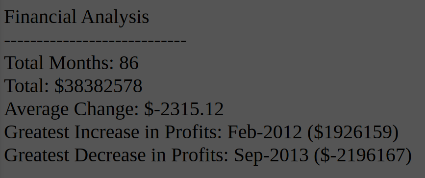

# Console-Finances-by-SehCheong
Using javascript to analyse a monthly profit table.

This Javascript application is used to perform a financial analysis.

App link : https://sehcheong-ng.github.io/Console-Finances-by-SehCheong/

The dataset is the monthly Profit/Losses of a company between the period of Jan-2010 and Feb-2017 (A total of 86 months).

The stakeholder wishes to understand the financial situation of this company with the calculation below:

-Total number of months in the dataset
    Done by counting the record in the dataset

-Net total amount of profit/losses over the entire period
    Done by performing a sum over all amount in the dataset

-Average changes in profit/losses over the entire period
    Done by:
        1. Calculate the change between each month (first month excluded)
        2. Calculate the sum of all the changes (Total change)
        3. Divide the total by the number of months study

-Greatest increase in profit
    Done by looping through the change array and get the largest number

-Greatest decrease in profit
    Done by looping through the change array and get the smallest number

The end result is a table with all the calculation (in both Console and web page.)

Enjoy!
